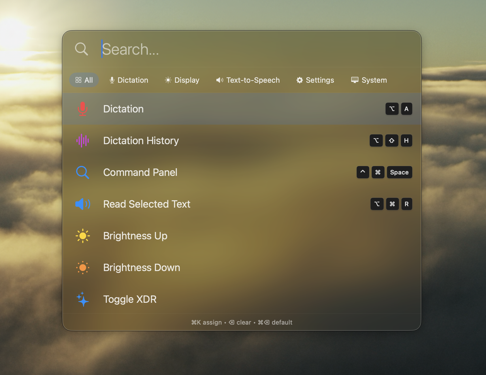
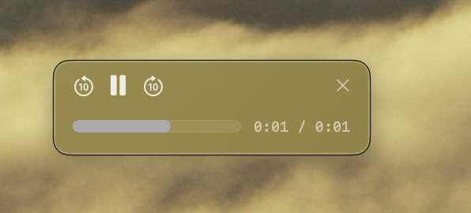
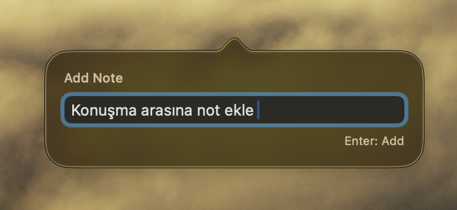

# Changelog

> [Türkçe](CHANGELOG.md)

## [0.5.0] - 2025-12-09

### New Features

**Command Panel** `⌃⌘Space`
- Alfred-like search panel - access all commands from one place
- Actions Popover `⌘K`: Quick actions (Execute, Set Hotkey, Clear, Reset)
- Nested Selectors: Settings submenu (→ to open, ← to go back)
- Multi-select: Space to toggle, Enter to batch execute

**Dictation**
- Add Note `⌥S`: Add text note during recording (stack on right)
- Settings: Language, Model, Silence Sensitivity selectors

**Session**
- Settings: Idle Reset, Lifecycle, Notifications
- Previous Sessions: Multi-select for batch copy

**Display**
- Display Toggle: Turn Studio Display or built-in on/off

**System**
- Text-to-Speech (TTS) `⌘⌥R`: Read selected text aloud

### Improvements
- Recently used commands appear first (MRU sorting)
- Tab/Shift+Tab to navigate categories
- Access turned-off displays via cache
- Localized status notifications
- Conditional hotkeys: ⌘W in Chrome closes tab

### Screenshots

---

## [0.4.3] - 2025-12-07

### Changes
- **Hotkey swap**: `⌥A` = Voice only (human), `⌥⇧A` = Clipboard-aware (AI)
- **Human-readable output**: Clipboard references shown as `[1:App]` with footer
- **Full Turkish UI**: Menu bar, panels, alerts and all UI now in Turkish

### Improvements
- `dictation.getEntries` response includes meta (count, limit) for agent pagination awareness
- Whisper hallucination filter removes garbage text ("Altyazi M.K.", "Subscribe", etc.)
- Clipboard feedback shown in both modes (not just AI mode)
- Scroll support for long clipboard previews (VS Code style)
- Whisper double space between words fixed
- Snippets now use markdown format (easier to edit)
- About panel: "Voice Clipboard Manager" subtitle
- About panel: Release date now displays correctly

### Developer (Beta)
- **Voice Snippet Suggestions**: Say keywords during recording to get snippet suggestions (1-5 hotkeys to copy)

---

## [0.4.2] - 2025-12-07

### Improvements
- Event-driven chunk completion (replaces polling for faster response)
- Thread-safe context key reading with AtomicContextKeys
- License panel input field wider (340px) for better visibility
- Sparkle version format changed to semantic (402, 403...)

### Fixes
- "Check for Updates" now correctly detects new versions
- ESC key properly consumed during recording (no longer passes to other apps)
- Recording state sync from single source (setIsRecording)

---

## [0.4.1] - 2025-12-06

### New Features
- **Caps Lock Hyper Key**: Use Caps Lock as a modifier (Caps+A, Caps+B, etc.)
- **HTTP Batch Requests**: Agent-friendly API with array-only format
- **Dictation Hotkeys**: Assign hotkeys to switch language (Auto/English/Turkish) and model (Fast/Accurate)

### Improvements
- Hotkey panel opens with "All" filter by default
- Extended keyboard key mappings for special characters
- ESC closes hotkey panel when not recording
- Adaptive clipboard polling (100ms during recording, 500ms idle)
- "Report Issue..." menu item for quick GitHub feedback
- "Open Logs" moved to Tools menu

### Fixes
- Hotkey registration and conflict detection fixed
- Own paste no longer captured in clipboard history
- ESC properly cancels transcription and clears clipboard toasts
- Model switch blocked during recording/transcribing (prevents crash)
- Stuck hint now shows above pipeline without overlap
- ESC consumed during hotkey recording (no longer passes to other apps)

---

## [0.4.0] - 2025-12-05

### Transcription is Now Lightning Fast
- Record as long as you want - transcription happens in the background
- No more waiting after you stop recording
- 70% faster than before
- Cleaner results with automatic silence removal

### New Features
- **Dictation** `Option+Shift+A`: Voice to text, paste directly
- **Clipboard Mode** `Option+A`: Include what you copied in your transcription for AI conversations
- **Clipboard Stack**: See your copied items while recording, hover to preview
- **Language Selection**: Choose your transcription language from the menu
- **Model Selection**: Pick between Accurate or Fast transcription
- **Silence Sensitivity**: Control how sensitive the recording is to pauses
- **Session Tracking**: See how long you've been at your computer
- **Idle Alerts**: Get reminded when you've been inactive too long (15min-2h)
- **Sleep Detection**: Automatically resets after overnight breaks
- **Session Notifications**: Know when you hit time milestones
- **XDR Brightness**: Push your display brighter than the normal limit
- **Keyboard Cleaner**: Lock your keyboard to safely wipe it down
- **Hotkey Panel**: See and customize all shortcuts in one place
- **Secure API Keys**: Your keys are stored safely in macOS Keychain
- **Crash Reporting**: We know when something breaks so we can fix it

### Better Experience
- App never freezes while transcribing
- Hotkeys respond instantly
- Permissions asked only when needed
- See transcription progress: REC -> Recorded -> % -> Pasted
- Stuck? A hint appears after 3 seconds
- See clipboard items inline in history
- Fresh new icon

### Menu & Settings
- "Check for Updates..." now at top level
- Auto-update toggle in About panel
- Cleaner menu without developer options
- Quick links to GitHub in About panel

### Fixes
- ESC key works everywhere now
- Arrow keys work in search
- Audio stops cleanly when you stop it
- Session time saved between restarts

### Screenshots

---

## [0.3.0] - 2025-11-28

### New Features
- Control display brightness with F1/F2
- Turn off your built-in display
- Search through your transcription history

---

## [0.2.0] - 2025-11-26

### Initial Release
- Voice to text
- Global hotkeys
- Menu bar interface
- Automatic updates
