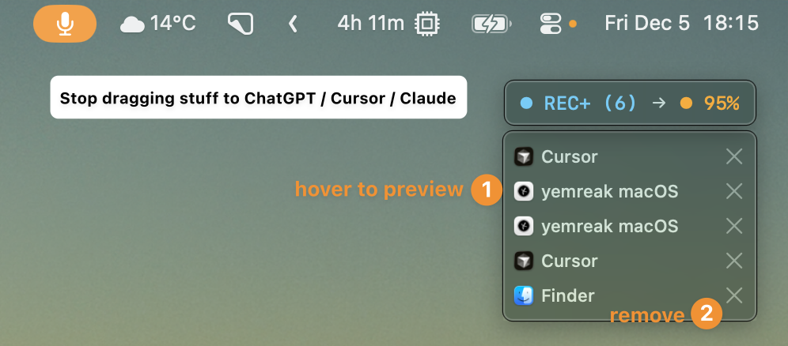
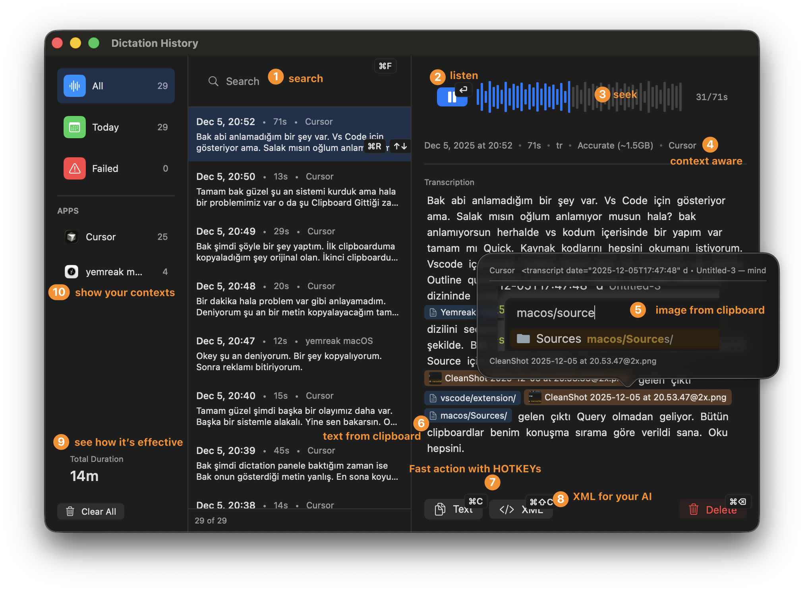
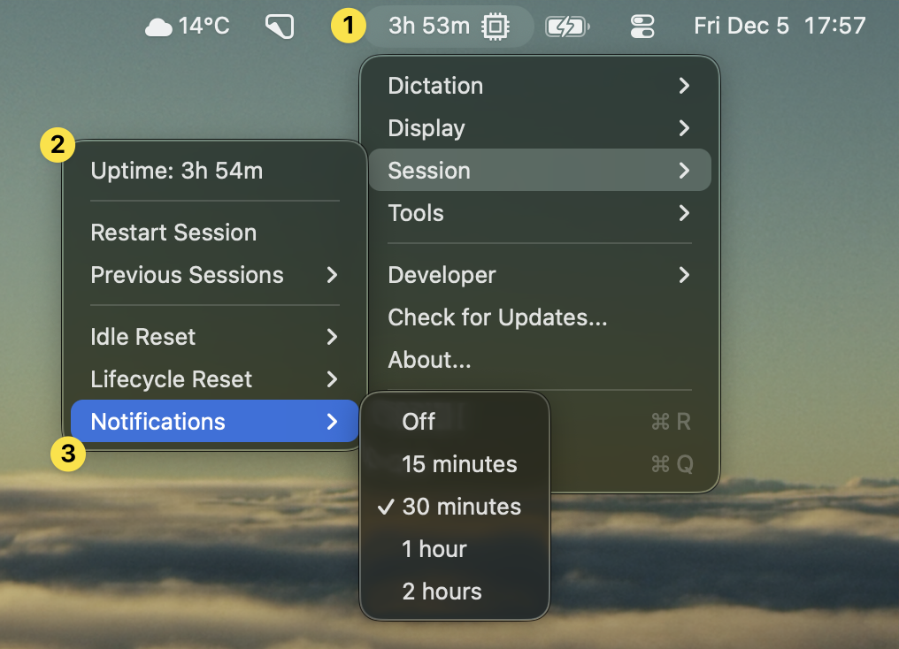
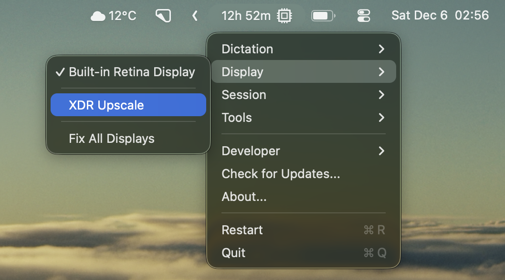
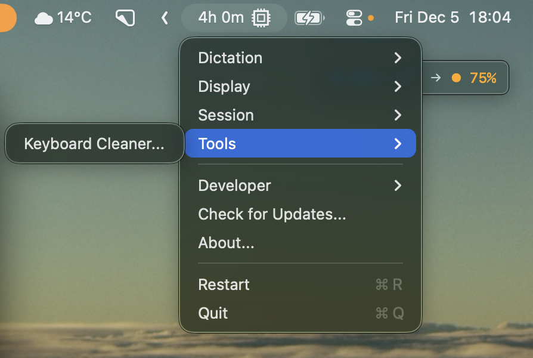
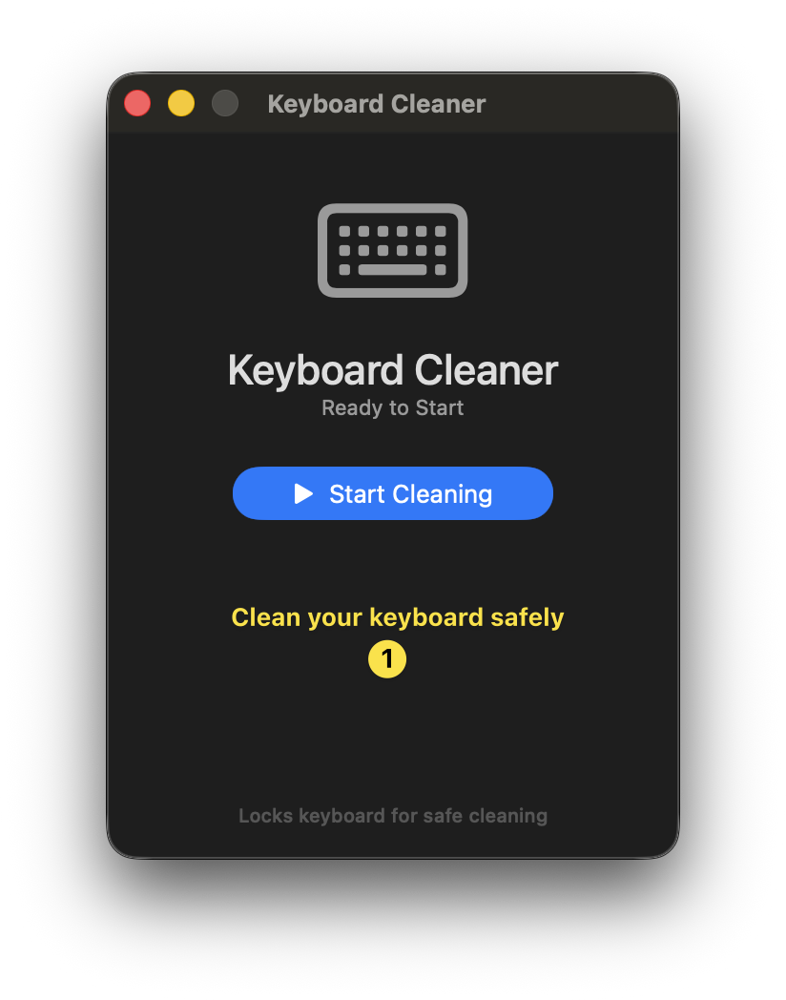
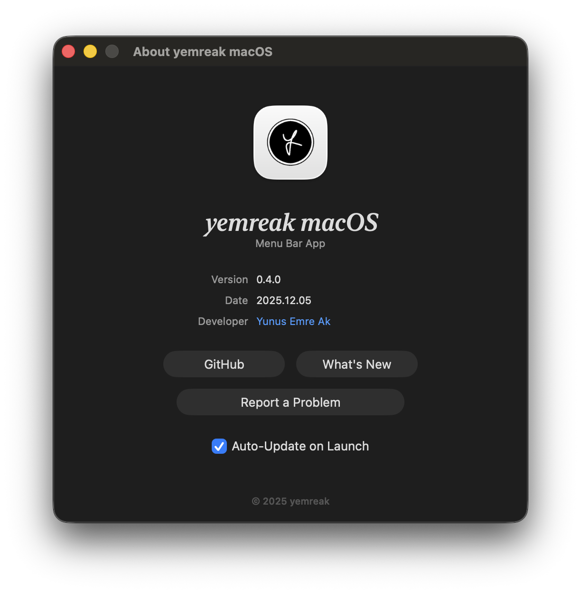

# yemreak macOS

Context-aware voice for AI _— and a few tools I built for myself_

- Clipboard context for AI conversations `⌥A` - captures at record start & stop
- Voice dictation that actually works offline `⌥⇧A`
- Session tracking to prevent burnout
- XDR brightness for outdoor working `F1/F2`

## Features

- **Dictation** - Voice-to-text, clipboard mode, language & model selection
- **Display** - XDR brightness, built-in display toggle, F1/F2 control
- **Session** - Screen time tracking, sleep detection, idle alerts
- **Tools** - Keyboard cleaner

### Dictation
- **Clipboard Mode** `⌥A` (Option+A) - Transcription with clipboard context
- **Voice Dictation** `⌥⇧A` (Option+Shift+A) - Lightning fast local speech-to-text

### Session
- **Session Tracking** - Screen time, sleep detection, idle alerts

### Display
- **XDR Brightness** - Push brightness beyond normal limits
- **Display Control** - F1/F2 brightness, toggle built-in display

### Tools
- **Keyboard Cleaner** - Lock keyboard for cleaning

### About
- **Auto Updates** - Always stay up to date

## Installation

1. Download `yemreak-macOS.dmg` from [Releases](https://github.com/yemreak/yemreak-macos/releases)
2. Mount and drag to Applications
3. Grant permissions: Microphone, Accessibility

## Requirements

- macOS 14.0+
- Apple Silicon (M1/M2/M3)

## Updates

Menu Bar → Check for Updates...

## Keyboard Shortcuts

| Shortcut | Symbol | Action |
|----------|--------|--------|
| Option + A | `⌥A` | Clipboard mode |
| Option + Shift + A | `⌥⇧A` | Voice dictation |
| Option + Escape | `⌥⎋` | Cancel transcription |
| Escape | `⎋` | Cancel recording |
| F1 / F2 | | Brightness down/up |
