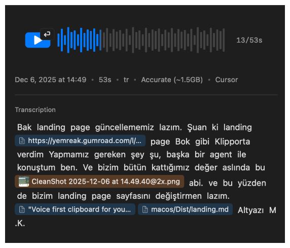
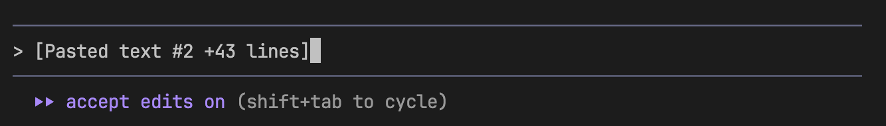
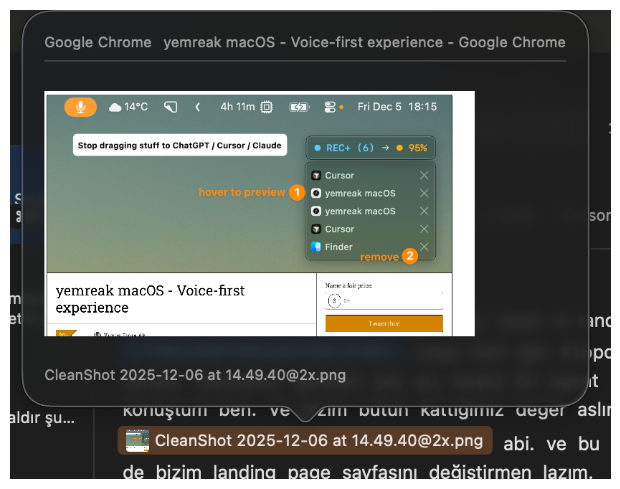
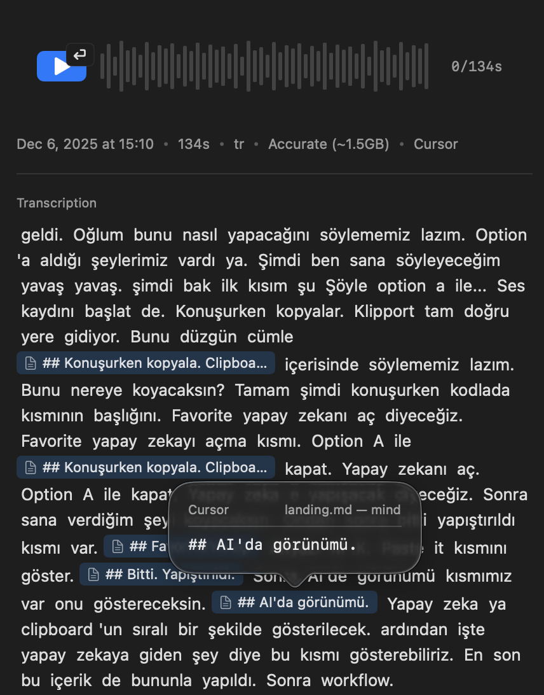
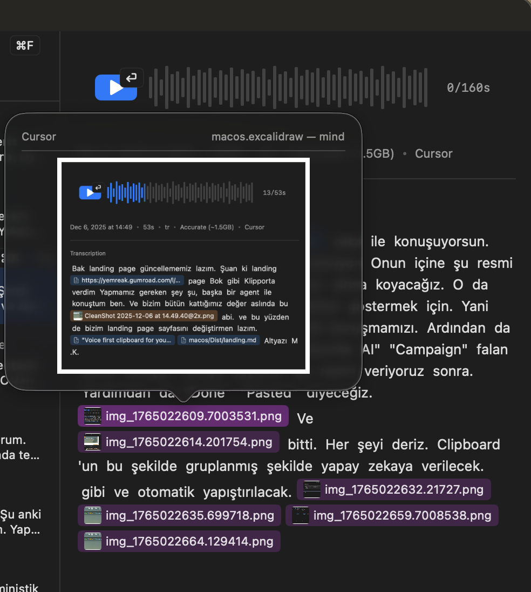
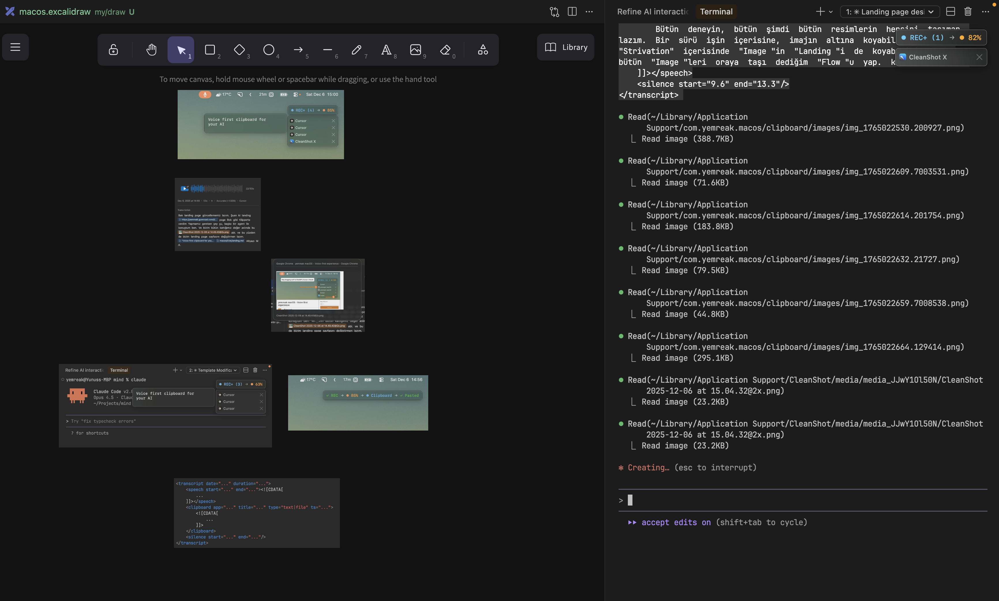

# Speak, copy, AI gets it — including where it came from.

[**Download**](https://github.com/yemreak/yemreak-macos/releases/latest)

## Sound familiar?

In Cursor:

Cmd+C, Cmd+V, Cmd+C, Cmd+V...

Take a screenshot, copy, paste

wait..

"The previous one", "the next one", "the first one I sent", "not that one!"

Every. Single. Time.

## There's a solution.

Voice clipboard manager for macOS.

`Option+A` → Start speaking. Copy while talking — what you copied, where you copied from, AI sees it all. `Option+A` → Paste everything in order. Done.

_To just convert speech to text, use `Option+Shift+A`_

## What does it look like?

This is how your text and clipboard contents are sent to AI:

You can also preview your clipboard history:

## What else can you do?

- **No internet at the cafe?** `Option+Shift+A` → Speak offline, paste.
- **Hours in front of the screen?** → Get break reminders.
- **Can't see the screen in sunlight?** `F1/F2` → Go beyond Apple's limits.
- **Keys pressing while cleaning keyboard?** → Lock, clean, unlock.

## Here's how I work

