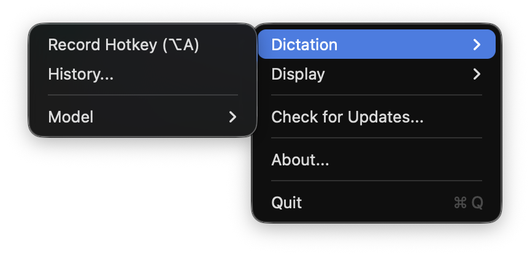
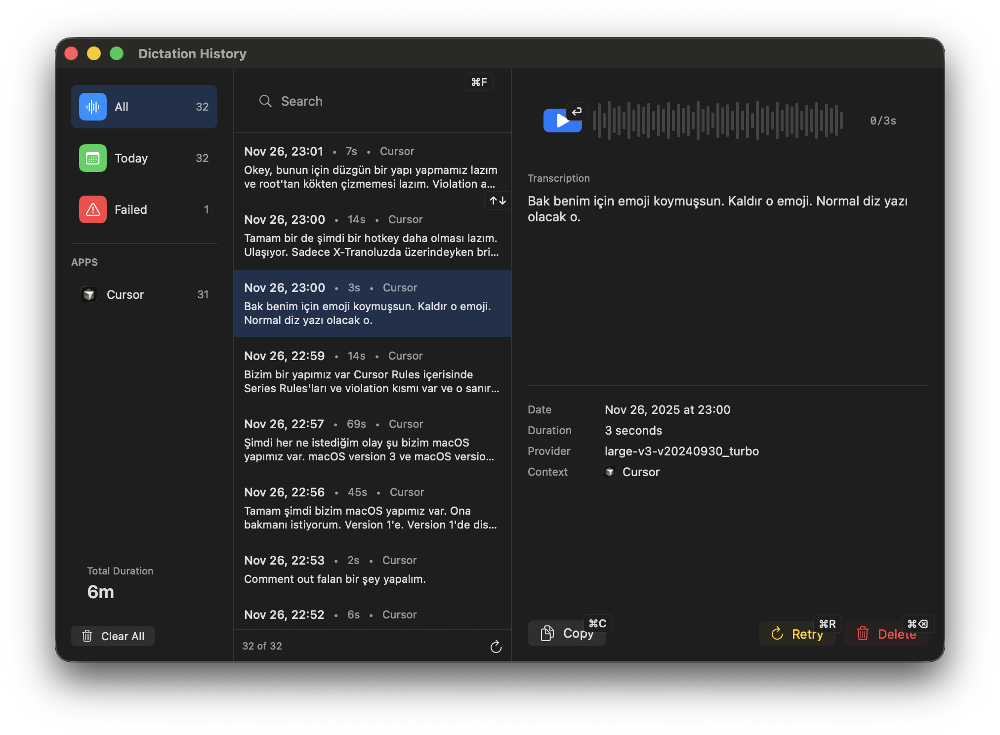
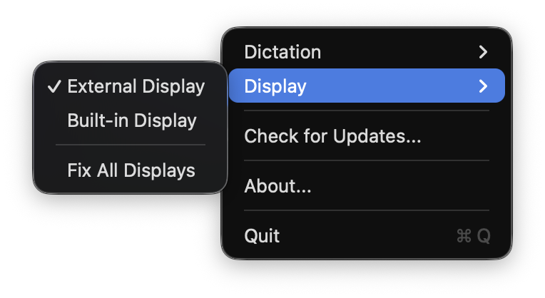

# yemreak macOS

Menu bar productivity app for macOS.

## Features

- Voice Dictation - Local speech-to-text via WhisperKit
- Global Hotkeys - Trigger actions from anywhere
- Transcription History - Browse and search past dictations
- Display Control - F1/F2 brightness for external displays, toggle built-in display off
- Auto Updates - Sparkle integration

## Installation

1. Download `yemreak-macOS.dmg` from [Releases](https://github.com/yemreak/yemreak-macos/releases)
2. Mount and drag to Applications
3. Grant permissions: Microphone, Accessibility

## Requirements

- macOS 14.0+
- Apple Silicon (M1/M2/M3)

## Updates

Menu Bar → Check for Updates...
