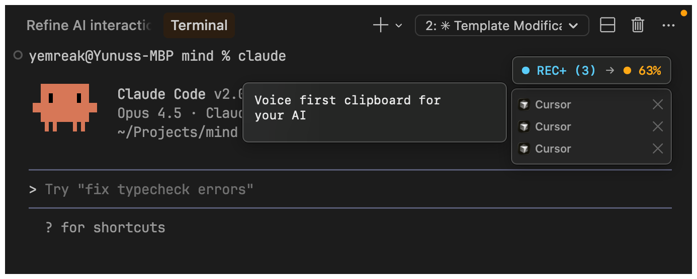
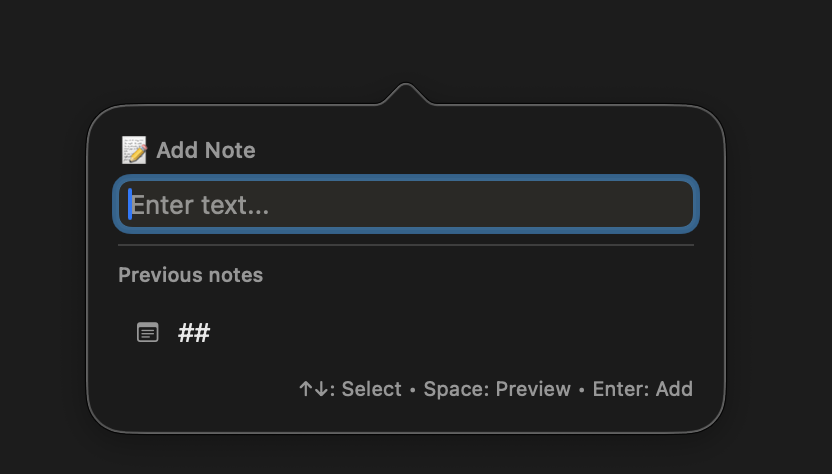
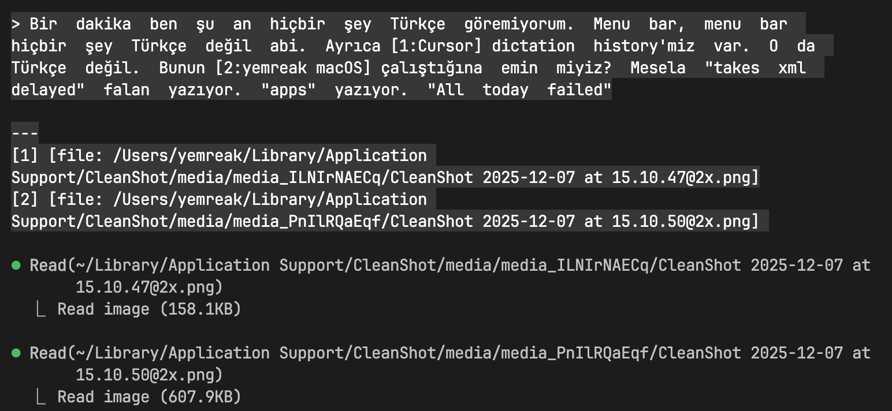
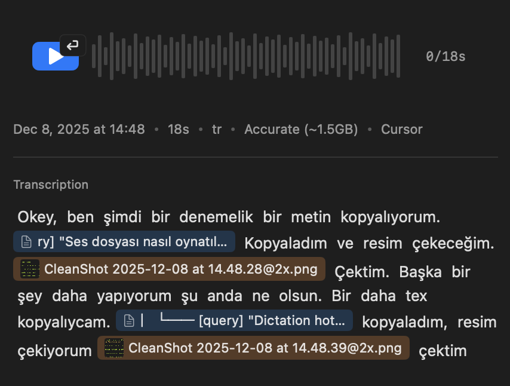

# I work 10-14 hours with AI. I don't want to type. I want to talk.

> [Turkce](landing.md)

## Clipboard Collision

6-7 terminals open. Each with a different AI. I give instructions to one, switch to the next.

"Look at this. Fix that. Open that file. Check there."

I copy while talking. But I say a lot of "this, that, this, that". AI doesn't understand what I meant by the last "this". Because my clipboard items arrive at the end in bulk — not synced with my speech.

**Solution:** My copies align with my speech in the same timestamp. The moment I say "look at this", whatever I copied at that moment goes right there. My speech flow stays intact, I don't have to think "what did I say?" afterwards.

## Batch Copying

5 images to share. Normally: copy-paste, copy-paste, copy-paste... Switch windows each time, go back to AI, paste, come back. 2 minutes.

My system: While talking, I say "first image shows this, second image does that". I copy, keep talking. Looking at one place — no context switching, no distraction. 5-10 seconds. You don't even notice, you're already explaining. You're in the flow.

## Context Loss

I gave instructions to the AI in the first terminal, moved to the second. If the first one misunderstood, I need to go back and re-enter that context. But I've left that context, I'm doing new work with someone else. If I go back, I'll get confused — I'll forget the work with the other AIs too. As I switch contexts, as I return to my old idea, my connection to my new idea breaks. I can't move fast.

**Solution:** Get understood correctly the first time. No "this", "that", "it" ambiguity thanks to clipboard alignment. No need to go back.

## Waiting Stress

I used MacWhisper. It makes you wait. My speech ended, transcription still going. I want to quickly give instructions and move to the next AI but I have to wait. During the wait, my ideas start fading. Even 2 seconds is hard to hold. What was I going to say? Stress builds up. I get frustrated.

**Solution:** Transcription the moment I stop. Doesn't wait for the sentence to end. Text ready the instant speech ends — I can send the output to AI the moment I finish my thought.

## Flow Interruption

I got an idea out. But I spoke incompletely — I need to add "this also came to mind". I want to add it immediately. In MacWhisper, pressing ESC cancels. I wait for transcription, it doesn't let me. Flow breaks, rhythm breaks. I have to wait again, think again.

**Solution:** Sequential recordings. I can start the second recording before the first transcription finishes. Third one too. I don't have to wait for the previous recording — the system handles them in order.

## Inline Notes

While talking, something written comes to mind. I need to insert text in the middle of my speech. But I'm working in terminal — finding the recording, finding the right spot, inserting text there is hard. I don't want to look back, I just want to keep running.

**Solution:** `Option+S` → I can write notes while speech continues. My text goes right at that moment. Like a meeting chat — I talk with AI like I'm in a meeting, write in chat in between.

## History Search

"I explained this to AI before, I remember." But where? Which recording? I need to search inside my voice recordings. I need to find that moment.

**Solution:** Conversation history + search. I can access my conversations, search within them. What I want to search for is my idea — not which AI I used, not which date, not which file I worked on. What matters is my idea.

## What's the experience like?

`Option+A` → Start talking. Copy while talking. `Option+A` → Paste.

> — when, what you copied, where you copied from — all recorded

_Start recording in Claude Code terminal, see what you copied_

_Add notes while talking_

_Paste with one key_

_Your speech + copies go to AI in order_

Preview your recordings from history:

## And my other personal tools

- **No internet at the cafe?** `Option+Shift+A` → Speak offline, paste.
- **Hours at the screen?** → Break time reminder.
- **Screen invisible in sunlight?** `F1/F2` → Go beyond Apple's limit.
- **Keys pressing while cleaning keyboard?** → Lock, clean, unlock.

## Vision

Synchronous, not asynchronous communication with AI. Working with computers as if talking to a human.

> I collect solutions to every problem I face with AI in one place.
